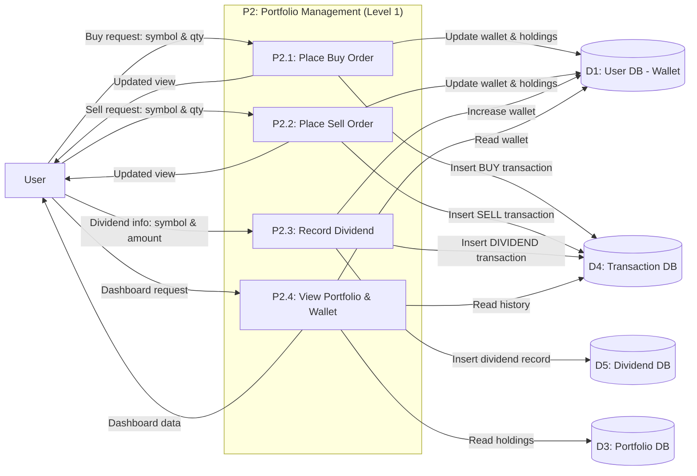

```mermaid
flowchart LR
    User["User"]

    subgraph P2["P2: Portfolio Management (Level 1)"]
        P2_1["P2.1: Place Buy Order"]
        P2_2["P2.2: Place Sell Order"]
        P2_3["P2.3: Record Dividend"]
        P2_4["P2.4: View Portfolio & Wallet"]
    end

    DS_User[(D1: User DB - Wallet)]
    DS_Portfolio[(D3: Portfolio DB)]
    DS_Txn[(D4: Transaction DB)]
    DS_Dividend[(D5: Dividend DB)]

    User -->|"Buy request: symbol & qty"| P2_1
    P2_1 -->|"Update wallet & holdings"| DS_User
    P2_1 -->|"Insert BUY transaction"| DS_Txn
    P2_1 -->|"Updated view"| User

    User -->|"Sell request: symbol & qty"| P2_2
    P2_2 -->|"Update wallet & holdings"| DS_User
    P2_2 -->|"Insert SELL transaction"| DS_Txn
    P2_2 -->|"Updated view"| User

    User -->|"Dividend info: symbol & amount"| P2_3
    P2_3 -->|"Increase wallet"| DS_User
    P2_3 -->|"Insert dividend record"| DS_Dividend
    P2_3 -->|"Insert DIVIDEND transaction"| DS_Txn

    User -->|"Dashboard request"| P2_4
    P2_4 -->|"Read wallet"| DS_User
    P2_4 -->|"Read holdings"| DS_Portfolio
    P2_4 -->|"Read history"| DS_Txn
    P2_4 -->|"Dashboard data"| User
```