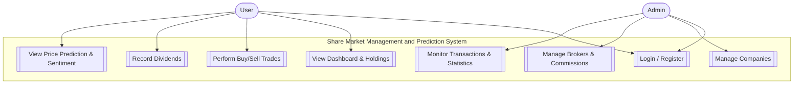

```mermaid
flowchart TB
    actorUser(["User"])
    actorAdmin(["Admin"])

    subgraph System["Share Market Management and Prediction System"]
        UC_Login[["Login / Register"]]
        UC_ViewDashboard[["View Dashboard & Holdings"]]
        UC_Trade[["Perform Buy/Sell Trades"]]
        UC_Dividend[["Record Dividends"]]
        UC_ViewPrediction[["View Price Prediction & Sentiment"]]
        UC_ManageCompanies[["Manage Companies"]]
        UC_ManageBrokers[["Manage Brokers & Commissions"]]
        UC_Monitor[["Monitor Transactions & Statistics"]]
    end

    actorUser --> UC_Login
    actorUser --> UC_ViewDashboard
    actorUser --> UC_Trade
    actorUser --> UC_Dividend
    actorUser --> UC_ViewPrediction

    actorAdmin --> UC_Login
    actorAdmin --> UC_ManageCompanies
    actorAdmin --> UC_ManageBrokers
    actorAdmin --> UC_Monitor
```
