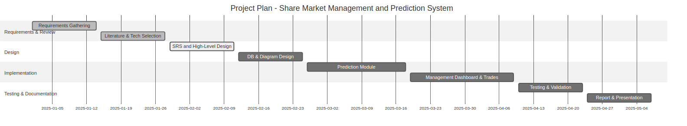
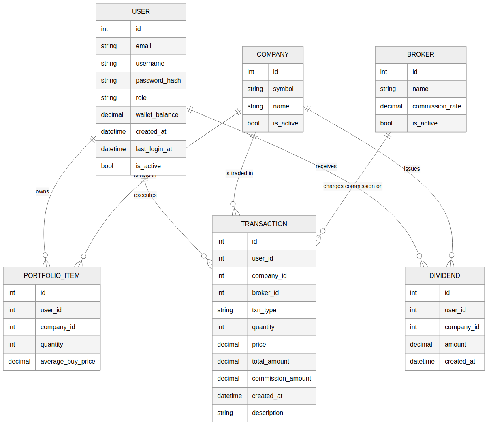
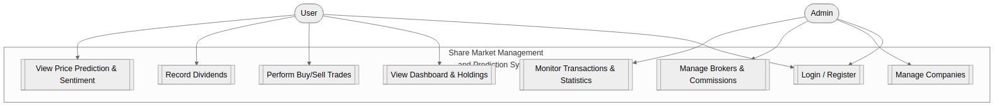
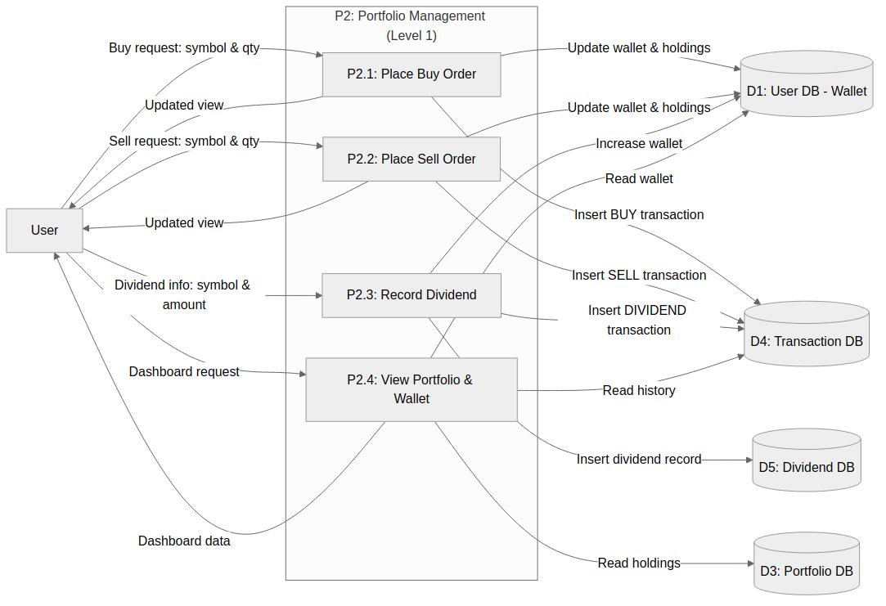

ABSTRACT

The financial market generates a massive volume of data every second, making it difficult for individual investors to analyze and make timely decisions. Existing tools either track prices or offer basic trading, but they rarely combine intelligent forecasting with integrated portfolio management in a single, user‑friendly platform.

This project presents a Stock Analysis & Market Sentiment system that integrates customer profiles, stock data, and predictive analytics into one full‑stack web application. The system provides simulated buy/sell transactions, fund and dividend tracking, broker commission management, and an admin monitoring dashboard. On the prediction side, an LSTM‑based model (with classical ARIMA and Linear Regression baselines) forecasts future stock trends using historical prices, while a sentiment analysis module aggregates recent financial‑news sentiment to give additional context. The backend is implemented in Python using Flask, with a SQLite database and responsive web interfaces, and the prediction outputs are visualised through interactive D3‑based charts and summary widgets on the results page.

The proposed system is intended for students, researchers, and amateur investors who wish to explore stock prediction and portfolio management in a safe, simulated environment. It closes gaps in the literature by embedding forecasting models into an end‑to‑end management workflow with explainable dashboards rather than providing prediction in isolation.

1. INTRODUCTION

1.1 Objectives

The main objectives of the Stock Analysis & Market Sentiment system are:

1. To design and implement a web‑based platform for simulated trading and portfolio management.
2. To develop machine learning models (LSTM with ARIMA/Linear Regression baselines) for next‑day stock price prediction.
3. To integrate sentiment analysis of financial news to complement purely historical price‑based signals.
4. To provide an admin interface for managing users, companies, brokers, and system‑level monitoring.
5. To offer intuitive visualizations and dashboards that help non‑experts understand prediction outputs and portfolio risk.

1.2 Problem Specification

The financial market generates massive volumes of heterogeneous data, including historical prices, technical indicators, macro‑economic variables, and unstructured news or social‑media text. Individual investors and students often lack the tools and expertise to:

· Collect and preprocess market data.
· Build and compare predictive models.
· Connect model outputs to actionable portfolio decisions.

Traditional systems and many academic prototypes either focus on pure prediction accuracy or basic record‑keeping. They generally do not offer:

· A complete workflow from prediction to simulated trading and portfolio tracking.
· Integrated management of customer profiles, brokers, and commissions.
· Transparent, educational dashboards that support learning and experimentation.

This project therefore specifies and implements a Stock Analysis & Market Sentiment system that:

· Provides user accounts, portfolios, and a virtual wallet for simulated trading.
· Enables stock buy/sell operations, dividend recording, and fund tracking.
· Embeds ML models and sentiment analysis directly into the user workflows.
· Restricts itself to simulated trading only (no real‑money transactions).

1.3 Methodologies

The project methodology can be summarized as follows:

· Data Preparation: Collect and clean historical stock price data and related time‑series features from public APIs such as Yahoo Finance and Alpha Vantage. Normalize and split data into training and testing sets in temporal order.

· Predictive Modelling:
  – Baseline models: Linear Regression and ARIMA to provide interpretable and classical benchmarks.
  – Deep learning model: A stacked LSTM network with dropout, trained on sliding windows of historical closing prices.

· Sentiment Analysis: Aggregate news articles and headlines for a given stock from free web sources (e.g., Finviz) and compute sentiment scores using tools such as VADER/TextBlob/FinVADER. Summarize polarity (positive/negative/neutral) over a recent time window and feed this into the final recommendation.

· System Design: Architect a three‑tier web application using Flask (backend), HTML/CSS/Bootstrap (frontend), and SQLite (database) for persistence. Define the database schema for users, companies, portfolio items, transactions, brokers, and dividends.

· Implementation: Implement authentication, portfolio management, commission calculation, and integration between the prediction flow and the management dashboard within a secure Flask application.

· Evaluation and Validation: Validate prediction models using error metrics such as RMSE on held‑out data and perform qualitative validation of management workflows via test scenarios and user stories.

2. LITERATURE SURVEY

Several recent works explore stock price prediction by combining historical prices with textual sentiment or macro‑economic factors. A brief survey is summarised below:

| No. | Author(s) / Year | Method / Algorithm | Key Findings | Limitations |
| --- | --- | --- | --- | --- |
| 1   | Ko & Chang (2021) | BERT \+ LSTM; price history \+ forum sentiment | Technical \+ textual data raise forecast accuracy | Taiwan‑only stocks; forum noise |
| 2   | Shimaa Ouf et al. (2024) | LSTM vs. XGBoost \+ Twitter sentiment | Twitter sentiment lifts AAPL, GOOGL, TSLA forecasts; XGBoost \> LSTM here | Short horizon; three stocks only |
| 3   | Darapaneni et al. (2022) | LSTM \+ sentiment \+ macro (oil, gold, USD) | Macro features \+ sentiment help Indian market prediction | Single country; small universe |
| 4   | Gupta et al. (2022) | HiSA‑SMFM: LSTM with historical & sentiment fusion | Clear gain from hybrid historical‑sentiment signals | Reduced dataset; generalisability open |
| 5   | Shahbandari et al. (2024) | CNN+LSTM \+ social‑media sentiment \+ candlestick | Multi‑modal data (sentiment \+ tech) cut error | Social signal noisy; heavy architecture |
| 6   | Journal of Big Data (2025) | VMD–TMFG–LSTM (feature decomposition) | Signal decomposition \+ LSTM sharply reduces RMSE/MAE | Complex pipeline; no sentiment used |

These studies collectively demonstrate that combining multiple data modalities (historical prices, sentiment, and macro variables) can improve prediction accuracy. However, most works stop at model evaluation and do not offer an integrated portfolio management interface or educational dashboards.

3. PROJECT PLANNING AND CHART

The project was planned in several phases, which can be represented using a Gantt chart in the final document. A textual summary is given below:

· Phase 1 – Requirements Gathering (Weeks 1‑2)
  – Study problem domain and collect user/mentor requirements.
  – Define in‑scope and out‑of‑scope features.

· Phase 2 – Literature Review and Technology Selection (Weeks 3‑4)
  – Survey existing work on stock prediction and sentiment analysis.
  – Finalise tech stack (Python, Flask, SQLite, ML libraries).

· Phase 3 – Design (Weeks 5‑6)
  – Draft SRS, use‑case diagrams, and database schema.
  – Plan the integration between prediction models and the management dashboard.

· Phase 4 – Implementation (Weeks 7‑10)
  – Implement authentication, portfolio management, trading simulation, and admin features.
  – Integrate ML models and sentiment analysis with the Flask backend.

· Phase 5 – Testing and Validation (Weeks 11‑12)
  – Unit and integration testing of routes, models, and data flows.
  – Evaluate predictive performance and refine preprocessing.

· Phase 6 – Documentation and Final Review (Weeks 13‑14)
  – Prepare project report, user guide, and presentation.
  – Incorporate mentor feedback and finalise artefacts.

In the formatted report, this schedule can be drawn as a Gantt chart with tasks plotted against calendar weeks.

Figure 5: Project Gantt Chart showing development phases and timeline

4. PROJECT DESCRIPTION

4.1 Software Model

The system follows a three‑tier architecture:

· Presentation Layer: HTML5, CSS3, Bootstrap, and JavaScript provide responsive web pages for login, dashboard, trading, and admin views.
· Application Layer: Python/Flask implements business logic for prediction, portfolio updates, commission application, and access control.
· Data Layer: SQLite stores users, companies, portfolio items, transactions, dividends, and broker information.

4.2 Software Requirements Specifications (SRS)

4.2.1 Functional Requirements

· User registration, login, and profile management.
· Company and stock data storage and update.
· Virtual wallet and fund tracking for simulated trading.
· Stock buy/sell operations and portfolio management.
· Dividend recording for invested stocks.
· Price prediction using LSTM and baseline models.
· Broker management, including commission rates and activation status.
· Admin dashboard for monitoring transactions, commissions, and top‑traded symbols.

4.2.2 Non‑Functional Requirements

· Usability: Simple and intuitive web interface suitable for students and amateur investors.
· Reliability: Consistent handling of transactions with database integrity ensured by SQLAlchemy.
· Performance: Reasonable response times for prediction and dashboard rendering on modest hardware.
· Security: Basic authentication, session management, and CSRF protection for critical routes.
· Portability: Deployable on standard Python/Flask environments with SQLite.

4.3 Functional Specification

4.3.1 Functions Performed

· Customer Profile
  – Maintain user details, roles (user/admin), wallet balance, and timestamps.

· Company Profile
  – Store listed companies with symbols, names, and active status.

· Fund Management
  – Track wallet balance, invested amount, and portfolio value.

· Stock Buy/Sell
  – Allow users to execute simulated trades, update portfolio items, and record transactions with commission.

· Dividend Payout
  – Record dividends per symbol and credit the user’s wallet.

· Price Prediction
  – Predict future stock prices using ML models and display results with charts and metrics.

· Billing and Reports
  – Provide transaction history and summary views suitable for export as reports.

· Broker Management
  – Let admin users configure brokers and commission rates and monitor total commission earned.

· Monitoring and Control
  – Admin panel for viewing user counts, transaction volume, transaction mix, and top traded symbols.

4.3.2 Limitations and Restrictions

· Real‑time trading on live exchanges is not supported.
· No integration with third‑party trading APIs.
· No real‑money transactions; all trades are simulated.
· External data scraping is limited to approved APIs and may be subject to rate limits.
· Predictive accuracy depends on data quality and training configuration; the system is intended for education and research, not for guaranteeing profits.

4.3.3 User Interface Design (Overview)

· Login and Registration Pages: Allow users to register, log in, and access the dashboard.
· User Dashboard: Displays wallet balance, invested amount, current portfolio value, unrealised P/L, holdings table, trade forms, dividend form, and recent transactions.
· Prediction Results Page: Shows selected stock information, price history, interactive D3‑based accuracy charts for ARIMA/LSTM/Linear Regression (actual vs. predicted), per‑model RMSE metrics, a seven‑day forecast table, sentiment charts, an external link to the corresponding Yahoo Finance quote page, and a textual recommendation that combines model outputs with aggregated sentiment.
· Admin Dashboard: Presents statistics (users, companies, brokers, transactions, commission, volume), broker management forms, and company management tools.

The UI is implemented with Bootstrap for responsiveness and follows a consistent colour theme across pages.

4.4 Design Specification

4.4.1 E‑R Diagram / Use‑Case Diagram (Textual Description)

Key entities include:

· User (UserID, Email, Username, PasswordHash, Role, WalletBalance, CreatedAt, LastLoginAt, IsActive)
· Company (CompanyID, Symbol, Name, IsActive)
· Broker (BrokerID, Name, CommissionRate, IsActive)
· PortfolioItem (ItemID, UserID, CompanyID, Quantity, AverageBuyPrice)
· Transaction (TxnID, UserID, CompanyID, BrokerID, Type, Quantity, Price, TotalAmount, CommissionAmount, Timestamp, Description)
· Dividend (DividendID, UserID, CompanyID, Amount, Timestamp)

Typical use‑cases:

· User registers and logs in.
· User views dashboard and holdings.
· User performs buy/sell trades.
· User records dividends.
· Admin manages brokers and companies.
· Admin monitors system statistics and transaction logs.

These can be represented in UML as use‑case diagrams and an E‑R diagram showing relationships between User, Company, Broker, PortfolioItem, Transaction, and Dividend.

Figure 1: Entity-Relationship Diagram of the Stock Analysis & Market Sentiment System

Figure 2: Use Case Diagram of the Stock Analysis & Market Sentiment System

4.4.2 Data Flow Diagrams (DFD)

At a high level (Level 0 DFD):

· External entities: User, Admin, Market Data APIs.
· Processes: Authentication, Portfolio Management, Prediction Engine, Sentiment Analysis, Admin Monitoring.
· Data stores: User DB, Company DB, Portfolio DB, Transaction DB, Dividend DB.

Figure 3: Data Flow Diagram Level 0 - Overall System Architecture

At Level 1, the Portfolio Management process expands into sub‑processes for Buy, Sell, and Dividend recording, each interacting with wallet balance and portfolio tables.

Figure 4: Data Flow Diagram Level 1 - Portfolio Management Subprocesses

4.4.3 Data Dictionary (Excerpt)

| Entity / Table | Attribute | Description |
| --- | --- | --- |
| User | id | Primary key for user |
| User | email | Unique user email |
| User | role | `user` or `admin` |
| Company | symbol | Stock ticker symbol |
| PortfolioItem | quantity | Number of shares held |
| Transaction | txn_type | `BUY`, `SELL`, or other type |
| Transaction | total_amount | Trade value before commission |
| Transaction | commission_amount | Commission charged by broker |
| Dividend | amount | Dividend credited to user |

The full data dictionary can be extended with remaining attributes and data types.

4.5 Testing

Testing activities include:

· Unit Testing: Verify individual functions such as commission calculation, wallet updates, and sentiment scoring.
· Integration Testing: Ensure correct interaction among Flask routes, database operations, prediction services, and templates.
· System Testing: Validate end‑to‑end scenarios such as “user logs in, performs a buy trade, sees updated holdings, and views prediction”.
· Validation Testing: Cross‑check that the implemented system meets the requirements specified in the SRS.

Sample test cases include:

· Test Case 1: Buy trade with sufficient wallet balance should succeed and reduce wallet by (price × quantity + commission).
· Test Case 2: Buy trade with insufficient balance should be rejected with an appropriate error message.
· Test Case 3: Sell trade should not allow selling more shares than currently held.
· Test Case 4: Recording a dividend should increase wallet balance and appear in transaction history.
· Test Case 5: Prediction view should load successfully for a valid symbol and display forecast and sentiment charts.

5. IMPLEMENTATION ISSUES

During development, several practical issues were encountered:

· Data Source and API Limitations: Public APIs used for market data and news are subject to rate limits and occasional downtime. The system therefore caches and reuses data where possible and falls back to graceful error messages when data cannot be retrieved.

· Database Choice and Migration: The initial design referenced MySQL/XAMPP, but the final implementation uses SQLite via SQLAlchemy to simplify setup and deployment. This required revising configuration and ensuring that the schema is created consistently on application start.

· Sentiment Analysis Dependencies: Some advanced sentiment tools (e.g., FinVADER) may be unavailable in certain environments. The implementation includes fallbacks to standard VADER so that sentiment charts and logs remain consistent even when optional packages are missing.

· Integration of Prediction and Management: Care had to be taken to integrate the prediction routes with the management dashboard without altering core prediction logic. Links from the dashboard to the prediction flow and back were added while preserving existing behaviour.

· Security Considerations: Implementing CSRF protection, secure session handling, and role‑based access control (user vs. admin) introduced additional complexity but is essential for a realistic management system.

6. EXPERIMENTAL RESULTS AND VALIDATION

At this stage, the system focuses on providing a complete and robust pipeline from data ingestion to prediction and simulated portfolio management. The following aspects have been validated:

· Functional Validation: Test scenarios confirm that user registration, login, wallet updates, buy/sell trades, dividend recording, and admin monitoring all work as expected on test data.

· Qualitative Prediction Assessment: The LSTM and baseline models produce plausible next‑day predictions on historical price series, and sentiment scores vary sensibly with positive and negative news headlines. Logs and debug hooks confirm that sentiment distributions are correctly computed, and the interactive accuracy charts (actual vs. predicted curves with optional Voronoi overlays) make it easier to visually inspect where each model over‑ or under‑shoots the true prices.

· Usability: The dashboard layout and forms follow a consistent Bootstrap‑based theme, and key actions (buy, sell, predict, record dividend) are accessible from the main screens.

Quantitative evaluation (e.g., RMSE, MAE, directional accuracy) can be performed by training the LSTM and baselines on a chosen dataset and computing metrics on a held‑out test set. These numeric results can be added to this section once final experiments are completed.

7. CONCLUSION, SUMMARY AND FUTURE SCOPE

This project developed a Stock Analysis & Market Sentiment system that combines simulated trading, portfolio management, and stock price prediction within a unified web application. The system enables users to register, manage a virtual wallet, execute buy/sell trades, record dividends, and view an integrated dashboard. Admin users can manage companies and brokers, monitor transaction volumes, and track commission income.

On the analytics side, the project integrates an LSTM model with classical baselines and sentiment analysis of financial news. This aligns with recent research trends that highlight the value of combining historical and textual information. Unlike many prior works, however, the proposed system embeds these models into a practical management interface aimed at education and experimentation.

Future enhancements include:

· Incorporating additional predictive models (e.g., transformer‑based architectures) and comparing their performance.
· Extending sentiment analysis to social‑media sources and multilingual news.
· Providing more advanced portfolio analytics such as risk measures, diversification metrics, and scenario analysis.
· Exploring optional integration with paper‑trading APIs, while keeping clear separation from real‑money trading.

8. REFERENCES

[1] Ko and Chang, 2021, BERT \+ LSTM; price history \+ forum sentiment.

[2] Shimaa Ouf et al., 2024, LSTM vs. XGBoost with Twitter sentiment for AAPL, GOOGL, and TSLA.

[3] Darapaneni et al., 2022, LSTM with sentiment and macro‑economic indicators for the Indian market.

[4] Gupta et al., 2022, HiSA‑SMFM: LSTM with historical and sentiment fusion.

[5] Shahbandari et al., 2024, CNN‑LSTM using social‑media sentiment and candlestick data.

[6] Journal of Big Data, 2025, VMD–TMFG–LSTM feature decomposition for improved stock prediction accuracy.

In the final Word document, these references can be expanded with full bibliographic details (titles, journal or conference names, volume, issue, pages) in standard IEEE style.